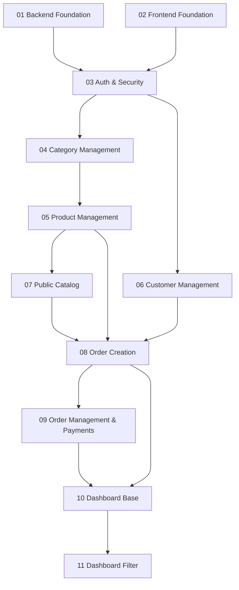

# Roadmap de Implementação Incremental — DevAI

Plano de entregas dividido em 11 mudanças com tamanho, complexidade e risco controlados (todos Baixo ou Médio).

## Estrutura de Dependências



## Resumo do Planejamento

| # | Change | Escopo | Tam. | Deps. | Testes U | Testes I | Testes E2E |
|---|--------|--------|:----:|:-----:|:--------:|:--------:|:----------:|
| 01 | Backend Foundation | NestJS + Prisma + todos os schemas + logger + health | P | — | 3 | 2 | 0 |
| 02 | Frontend Foundation | Next.js + App Router + layout base + services | P | — | 2 | 0 | 0 |
| 03 | Auth & Security | Clerk BFF + guards + UI custom (login/signup) | M | 01, 02 | 4 | 4 | 3 |
| 04 | Category Management | CRUD categorias (admin) | P | 03 | 4 | 4 | 2 |
| 05 | Product Management | CRUD produtos + imagem (admin) | M | 04 | 5 | 5 | 2 |
| 06 | Customer Management | CRUD clientes (admin) | P | 03 | 4 | 4 | 2 |
| 07 | Public Catalog | Vitrine + busca + categorias (público) | M | 05 | 4 | 3 | 4 |
| 08 | Order Creation | Carrinho + checkout + histórico (cliente) | M | 05, 06, 07 | 6 | 5 | 4 |
| 09 | Order Management | Status + pagamentos + auditoria (admin) | M | 08 | 6 | 6 | 4 |
| 10 | Dashboard Base | KPIs: total, recebido, pendente | P | 08, 09 | 3 | 2 | 2 |
| 11 | Dashboard Filter | Filtro por período | P | 10 | 3 | 3 | 3 |

**Legenda**: Tam. = Tamanho (P=pequeno, M=médio). Testes U = testes unitários. Testes I = testes de integração.

## Ordem de Execução Recomendada

```
Fase 1 — Fundação (paralelo)
  └─ 01 Backend Foundation
  └─ 02 Frontend Foundation

Fase 2 — Identidade
  └─ 03 Auth & Security

Fase 3 — Cadastros (paralelo após 03)
  ├─ 04 Category Management
  ├─ 05 Product Management (após 04)
  └─ 06 Customer Management

Fase 4 — Vitrine
  └─ 07 Public Catalog (após 05)

Fase 5 — Pedidos
  ├─ 08 Order Creation (após 05, 06, 07)
  └─ 09 Order Management & Payments (após 08)

Fase 6 — Métricas
  ├─ 10 Dashboard Base (após 08, 09)
  └─ 11 Dashboard Filter (após 10)
```

## Critérios de Qualidade (todas as mudanças)

- **Linter**: ESLint — sem erros
- **Cobertura**: mínimo 80% linhas e branches (backend), 70% (frontend)
- **Testes unitários**: validar regras de negócio isoladamente
- **Testes de integração**: validar endpoints, persistência e autorização
- **Testes E2E**: validar fluxos críticos de usuário (Playwright)
- **Pipeline**: lint → unit → integration → E2E → cobertura
