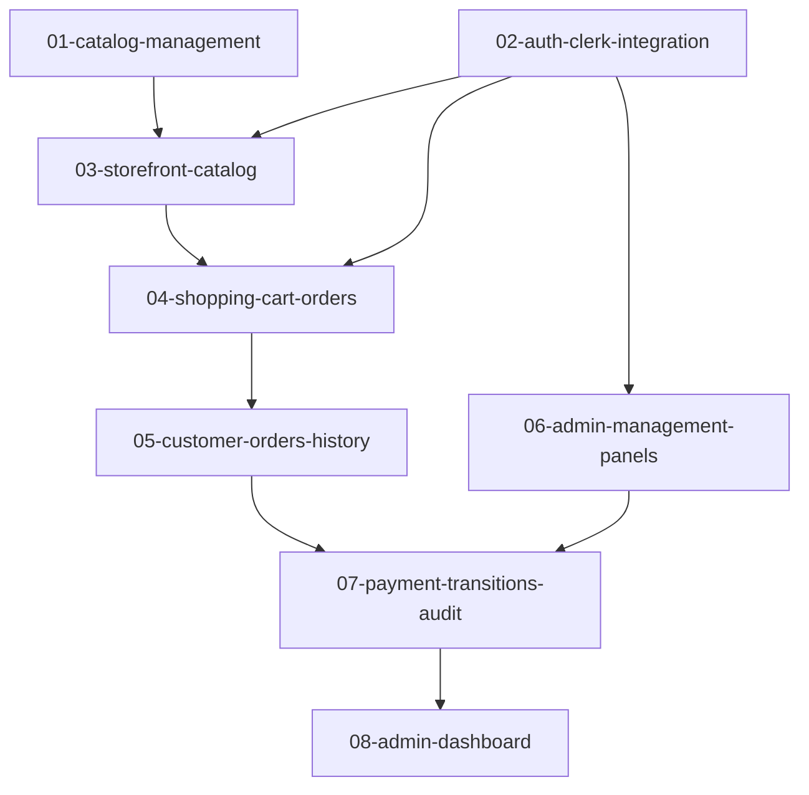

# Roadmap de Implementação Incremental — DevAI

Este documento apresenta o plano de desenvolvimento incremental para a aplicação full stack DevAI, dividindo as entregas em 8 mudanças com tamanho, complexidade e risco controlados (todos classificados como Baixo ou Médio).

Cada mudança tem seu ciclo de vida completo regido por testes em conformidade com as diretrizes do projeto (Pirâmide de Testes e cobertura mínima de 80% no Backend / 70% no Frontend).

---

## Estrutura de Mudanças

---

## Resumo do Planejamento

| ID | Mudança | Escopo Principal | Complexidade / Risco | Dependências |
| :--- | :--- | :--- | :---: | :--- |
| **01** | `01-catalog-management` | Refinamento da persistência e APIs do Catálogo (Categorias/Produtos). | Baixo / Baixo | Nenhuma |
| **02** | `02-auth-clerk-integration` | BFF de Autenticação com Clerk & Tela de Login customizada. | Médio / Médio | Nenhuma |
| **03** | `03-storefront-catalog` | Vitrine de Produtos interativa (Catálogo, Busca e Filtro). | Médio / Baixo | `01`, `02` |
| **04** | `04-shopping-cart-orders` | Carrinho de compras no Frontend e criação de pedidos com validação no Backend. | Médio / Médio | `03` |
| **05** | `05-customer-orders-history` | Acompanhamento e detalhe de pedidos de clientes & cancelamento. | Médio / Baixo | `04` |
| **06** | `06-admin-management-panels` | Telas de CRUD de Categorias, Produtos e Clientes para Administradores. | Médio / Médio | `02` |
| **07** | `07-payment-transitions-audit` | Transições de status de pedidos, auditoria de mudanças e registro de pagamentos. | Médio / Médio | `05`, `06` |
| **08** | `08-admin-dashboard` | Dashboard financeiro com indicadores e filtro temporal. | Médio / Baixo | `07` |

---

## Detalhes das Mudanças Propostas

As propostas detalhadas com escopo, dependências, riscos e o plano de testes completo estão disponíveis em seus respectivos arquivos `proposal.md`:

1. **[01-catalog-management](file:///home/junilson/projetos/devai/openspec/changes/01-catalog-management/proposal.md)**
2. **[02-auth-clerk-integration](file:///home/junilson/projetos/devai/openspec/changes/02-auth-clerk-integration/proposal.md)**
3. **[03-storefront-catalog](file:///home/junilson/projetos/devai/openspec/changes/03-storefront-catalog/proposal.md)**
4. **[04-shopping-cart-orders](file:///home/junilson/projetos/devai/openspec/changes/04-shopping-cart-orders/proposal.md)**
5. **[05-customer-orders-history](file:///home/junilson/projetos/devai/openspec/changes/05-customer-orders-history/proposal.md)**
6. **[06-admin-management-panels](file:///home/junilson/projetos/devai/openspec/changes/06-admin-management-panels/proposal.md)**
7. **[07-payment-transitions-audit](file:///home/junilson/projetos/devai/openspec/changes/07-payment-transitions-audit/proposal.md)**
8. **[08-admin-dashboard](file:///home/junilson/projetos/devai/openspec/changes/08-admin-dashboard/proposal.md)**
